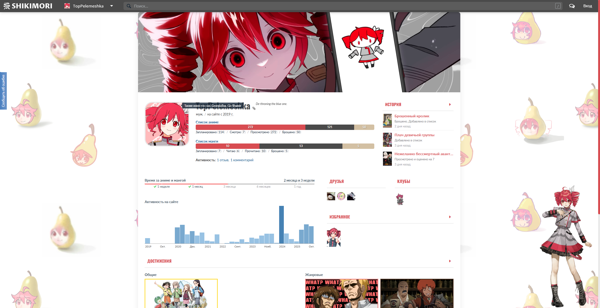

# Shikimori CSS Theme: Symphony No. 0401

Пользовательский CSS-стиль для профиля [Shikimori](https://shikimori.one), посвященный Касане Тето.

## ✨ Превью

  

## 🚀 Установка

1.  Скопируйте весь код из файла [`style.css`](./style.css).
2.  Перейдите в свой профиль на Shikimori.
3.  Откройте `Настройки` -> `Внешний вид сайта`.
4.  Вставьте скопированный код в текстовое поле для CSS.
5.  Нажмите "Сохранить". Готово!

## 🎨 Авторы изображений (Credits)

Большое спасибо авторам, чьи работы были использованы в этой теме!

*   **Обложка профиля:** работа от **[yasai31](https://x.com/yasai31_)**
*   **GIF-аватар:** [анимация с Tenor](https://tenor.com/ru/view/kasane-teto-teto-kasane-teto-teto-pear-utauloid-gif-9163606582616333830)
*   **Изображение в углу:** официальный арт **Kasane Teto Synthesizer V AI**, иллюстратор — **Sakauchi Waka**
*   **GIF для загрузчика:** работа от **[瀬奈悠太 (Sena Yuuta)](https://x.com/charon_mog_kero)**

---

 

# Shikimori CSS Theme: Symphony No. 0401 (English)

A custom CSS style for [Shikimori.one](https://shikimori.one) profiles, dedicated to Kasane Teto.

## ✨ Preview

  

## 🚀 Installation

1.  Copy all the code from the [`style.css`](./style.css) file.
2.  Go to your profile on Shikimori.
3.  Navigate to `Settings` -> `Site appearance`.
4.  Paste the copied code into the CSS text field.
5.  Click "Save". You're all set!

## 🎨 Image Credits

A huge thank you to the artists whose work was used in this theme!

*   **Profile Cover:** Art by **[yasai31](https://x.com/yasai31_)**
*   **GIF Avatar:** [Animation from Tenor](https://tenor.com/ru/view/kasane-teto-teto-kasane-teto-teto-pear-utauloid-gif-9163606582616333830)
*   **Corner Image:** Official art for **Kasane Teto Synthesizer V AI**, illustrator — **Sakauchi Waka**
*   **Loader GIF:** Art by **[瀬奈悠太 (Sena Yuuta)](https://x.com/charon_mog_kero)**